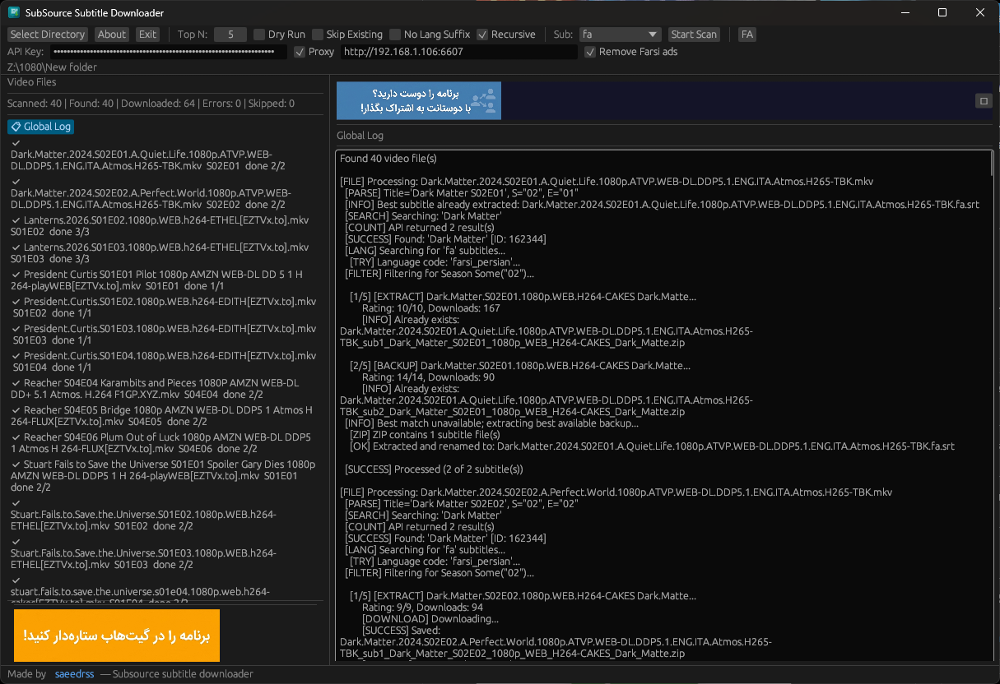

<p align="center">
  
</p>

# SubSource Subtitle Downloader

<div align="center">

[📖 فارسی — مستندات فارسی (faREADME.md)](faREADME.md)

Downloads subtitles for your movies and TV shows via the
[SubSource](https://subsource.net) API — best match saved next to the video,
top-N ZIP backups kept in `sub/`. Supports **19 languages**.

</div>



## 🖥️ Rust GUI (primary)

A single, cross-platform desktop app (Windows / macOS / Linux) built with egui —
no Python or runtime needed. Just download the binary and run it:

```bash
./sub-rs --gui
```

### GUI features

- 📁 **Select directory** — pick a folder, scan recursively into sub-folders
- 🌐 **19 subtitle languages** — dropdown selector (Farsi, English, Arabic, ...)
- 🚫 **Skip Existing** — skip videos that already have a subtitle
- 🏷️ **No Lang Suffix** — save as `movie.srt` instead of `movie.fa.srt`
- 🔀 **Language toggle** — switch the interface between **English / فارسی**
- 🔧 **Proxy** — enable/disable checkbox with live reload
- 🧪 **Dry Run** — test without downloading anything
- 🧹 **Remove Farsi ads** — strips ad & brand lines from `fa` subtitles
- ✍️ **Persian font** — Vazirmatn embedded, Farsi renders correctly in the GUI
- 📋 **Live logs** — per-file detail log + global log streamed in real time
- 🔔 **Update checker** — notifies when a new release is available

## ⚡ Quick Start

Pre-built binaries on the [Releases page](https://github.com/saeedrss/subsourceCLI/releases):

```bash
# GUI — launch the desktop app
./sub-rs --gui

# CLI — scan a directory and download best subtitles (default Farsi)
./sub-rs --directory "/path/to/videos"
```

Or build from source:

```bash
cd sub-rs
cargo build --release
./target/release/sub-rs --gui
```

## 🧰 CLI options

| Argument | Default | Description |
|---|---|---|
| `-d, --directory` | `.` | Directory to scan for video files |
| `--top` | `5` | Number of subtitle candidates to keep |
| `-l, --lang` | `fa` | Subtitle language code (`fa`, `en`, `ar`, ...) |
| `--api-key` | `SUBSOURCE_API_KEY` env or config file (built-in fallback) | API key |
| `--dry-run` | — | Log actions without downloading |
| `--no-recursive` | — | Only scan directory root |
| `--proxy` | `None` | Proxy URL (e.g. `http://127.0.0.1:8080`) |
| `--connect` | `direct` | Connection method: `direct`, `system`, `manual`, `cloudflare` |
| `--worker` | `None` | Cloudflare Worker URL (with `--connect cloudflare`) |
| `--skip-existing` | — | Skip videos that already have a subtitle |
| `--no-lang-suffix` | — | Save as `movie.srt` without the language suffix |
| `--clean-ads` | — | Strip Farsi ad & brand lines from downloaded `fa` subtitles |
| `--gui` | — | Launch GUI instead of CLI |

API key resolution: `--api-key` > `SUBSOURCE_API_KEY` env var > `~/.config/subsource/config.json` > built-in fallback.

## 📁 Output layout

```
video.mkv
video.fa.srt          ← best match (extracted and renamed; or video.srt with --no-lang-suffix)
sub/
  video_sub1_*.zip    ← best match (ZIP backup)
  video_sub2_*.zip    ← alternatives (up to --top)
```

## 🔌 Connection methods

The app can reach the SubSource API four ways (CLI `--connect`, or the radio
buttons in the GUI):

- **Direct** — no proxy at all.
- **System proxy** — use the OS/environment proxy automatically.
- **Manual proxy** — a proxy URL you type in (e.g. `http://ip:port`,
  `socks5://ip:port`).
- **Cloudflare** — route through a [Cloudflare Worker](cloudflare-worker/)
  that forwards to `api.subsource.net`, useful when your ISP blocks or
  throttles the API host directly.

```bash
# direct (default)
./sub-rs --directory "/path/to/videos"
# manual proxy
./sub-rs --connect manual --proxy "http://127.0.0.1:8080" --directory "/path/to/videos"
# cloudflare worker
./sub-rs --connect cloudflare --worker "https://subsource-proxy.example.workers.dev" --directory "/path/to/videos"
```

## ✨ Features

- Single ~10 MB Rust binary — CLI + GUI in one, no Python/runtime needed
- Cross-platform egui GUI: Windows, macOS, Linux
- Parses `S01E01` episode markers, matches subtitles by season & episode
- Movie names cleaned of tech specs (codec, resolution, groups) for better matches
- Falls back to folder name when the filename has no recognizable title
- 19 subtitle languages, English/Farsi interface
- Skip-existing detects both `movie.srt` and `movie.{lang}.srt`
- Partial success: a video counts as done when at least one subtitle is downloaded
  (or extracted from a saved backup / already present) — e.g. `✅ done 2/3`
- 1-second rate limiting between API calls
- Update checker with release notes

## 🐍 Legacy (Python)

Older Python interfaces are kept for reference but are **no longer the primary
way** to use the app:

```bash
python gui.py                                   # DearPyGui desktop app
python script.py --directory "G:\1080\MyShow"   # CLI
pip install -e subsourceCLI && subsourceCLI     # installable package
```

## 📚 Repository

- GitHub: https://github.com/saeedrss/subsourceCLI
- Releases: https://github.com/saeedrss/subsourceCLI/releases
- Author: [saeedrss](https://github.com/saeedrss)
